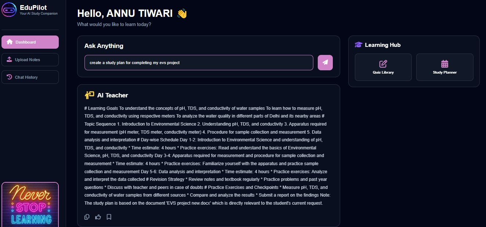
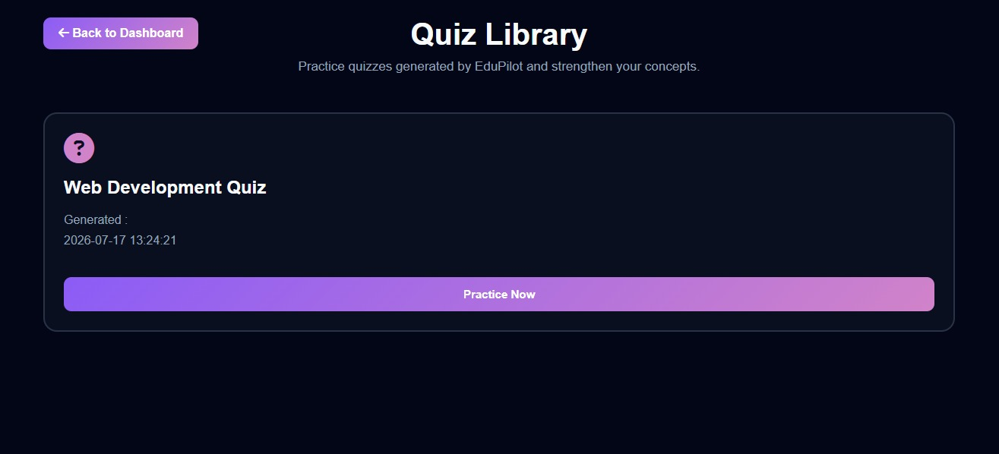
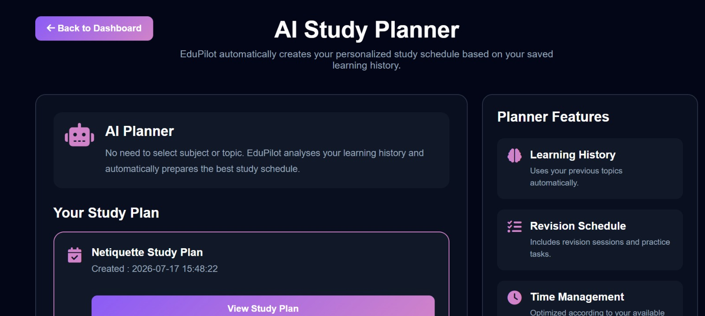

<div align="center">


# 🎓 EduPilot

### Your AI-Powered Multi-Agent Academic Learning Assistant

*Personalized • Context-Aware • Retrieval-Augmented • CrewAI Powered*

---

Built using **CrewAI**, **FastAPI**, **Groq LLM**, **ChromaDB**, and **Retrieval-Augmented Generation (RAG)** to provide an intelligent, personalized, and interactive learning experience.

</div>

---

# 📚 About EduPilot

EduPilot is an AI-powered academic learning platform designed to provide personalized assistance to students through a collaborative **multi-agent architecture**.

Unlike traditional AI chatbots that generate a single generic response, EduPilot intelligently understands the student's intent, retrieves relevant academic resources, selects the appropriate AI agents, and combines their outputs into a unified response tailored to the student's learning needs.

The system is powered by **CrewAI**, where multiple specialized AI agents collaborate to solve different aspects of a student's query. Whether the student wants to understand a difficult concept, generate quizzes, prepare a study plan, assess their understanding, or ask questions from uploaded notes, EduPilot automatically activates the required agents behind the scenes.

To ensure continuity across conversations, EduPilot maintains a personalized memory for every student. Each learner is assigned a **unique Student ID**, through which the platform stores profile information, learning progress, generated quizzes, study plans, and previous interactions. Every conversation is further organized using a **Session ID**, allowing multiple chat sessions while preserving complete conversation history.

EduPilot also integrates **Retrieval-Augmented Generation (RAG)** to provide document-aware responses. Students can upload study materials such as PDFs, DOCX, PPTX, TXT, and Excel files. These documents are processed, embedded into a vector database using **ChromaDB**, and retrieved whenever relevant questions are asked, ensuring accurate and context-aware answers.

Together, personalization, persistent memory, intelligent routing, and document retrieval make EduPilot a complete AI-powered study companion rather than a traditional chatbot.

---

# ✨ Key Features

## 🎯 Personalized Learning

* Unique Student Profile
* Personalized learning history
* Persistent academic memory
* Individual study recommendations

---

## 🤖 Multi-Agent Intelligence

EduPilot combines multiple AI agents that collaborate together:

* Router Agent
* Tutor Agent
* Quiz Agent
* Study Planner Agent
* Assessment Agent
* Memory Agent
* Academic RAG Tool

Each agent specializes in a different educational task, enabling modular and scalable problem-solving.

---

## 📄 Document-Based Learning (RAG)

Students can upload:

* PDF
* DOCX
* PPTX
* TXT
* XLSX

The uploaded documents are converted into embeddings and stored in ChromaDB, allowing EduPilot to answer questions directly from the student's own study materials.

---

## 🧠 Intelligent Prompt Routing

EduPilot supports complex prompts containing multiple learning requests.

Example:

> "Teach me Lunar Eclipse and create a study plan for Web Development."

Instead of generating one generic response, EduPilot:

* Detects multiple intents
* Separates the query
* Routes each task to the appropriate AI agent
* Combines all outputs into a single response

---

## 💬 Persistent Chat History

Every conversation is automatically stored using unique Session IDs, allowing students to revisit previous discussions without losing context.

---

## 📝 AI Quiz Generation

Automatically creates personalized quizzes based on:

* Student profile
* Previous learning
* Uploaded study materials

---

## 📅 AI Study Planner

Generates customized study schedules based on:

* Student level
* Previous learning
* Exam goals
* Uploaded syllabus

---

## 📊 Assessment Agent

Evaluates the student's understanding through multiple assessment modes and provides structured feedback.

---

# 🏗️ System Architecture

```text
                         Student
                            │
                            ▼
                     Landing Page
                            │
                            ▼
                  Student Registration
                            │
                            ▼
                     Memory Agent
                     (Student Profile)
                            │
                            ▼
                     Router Agent
                            │
        ┌──────────┬──────────┬──────────┬──────────┐
        ▼          ▼          ▼          ▼
     Tutor      Planner     Quiz     Assessment
        │          │          │          │
        └──────────┴──────────┴──────────┘
                     │
                     ▼
               Academic RAG Tool
                     │
                     ▼
                 ChromaDB Vector DB
                     │
                     ▼
               Personalized Response
```

---

# ⚙️ EduPilot Workflow

```text
Student

        │

        ▼

Landing Page

        │

        ▼

Profile Creation

        │

        ▼

Student ID Generated

        │

        ▼

Memory Agent

        │

        ▼

Dashboard

        │

        ▼

Student submits a query

        │

        ▼

Router Agent analyses intent

        │

        ├───────────────► Document Required?

        │                     │

        │                     ▼

        │              Academic RAG Tool

        │                     │

        ▼                     ▼

Tutor Agent   Quiz Agent   Planner Agent   Assessment Agent

        │         │              │                │

        └─────────┴──────────────┴────────────────┘

                    ▼

          Final AI Response Generated

                    ▼

Conversation saved using Session ID

                    ▼

Displayed in Chat History
```

---

# 🧠 Memory Architecture

EduPilot maintains personalized learning through a JSON-based memory system.

## Student ID

Every new student is assigned a unique **Student ID** during registration.

The Student ID is used to store:

* Student Profile
* Previous Learning
* Saved Quizzes
* Saved Study Plans
* Academic Progress

This information is stored inside the Memory Agent as structured JSON files, enabling personalized responses across future interactions.

---

## Session ID

Whenever a student starts a new conversation, EduPilot generates a unique **Session ID**.

Each session stores:

* User queries
* AI responses
* Conversation timeline

This enables multiple independent chat sessions while preserving complete conversation history.

The combination of **Student ID** and **Session ID** allows EduPilot to deliver continuity, personalization, and long-term learning support.

---

# 📄 Retrieval-Augmented Generation (RAG)

EduPilot enhances response accuracy using a Retrieval-Augmented Generation pipeline.

Workflow:

```text
Upload Notes

      │

      ▼

FastAPI Upload Endpoint

      ▼

Document Ingestion Pipeline

      ▼

Text Chunking

      ▼

Embedding Generation

      ▼

ChromaDB Storage

      ▼

Semantic Retrieval

      ▼

Relevant Context Retrieved

      ▼

Academic RAG Tool

      ▼

Groq LLM

      ▼

Context-Aware Response
```

By combining semantic retrieval with Large Language Models, EduPilot minimizes hallucinations and produces responses grounded in the student's uploaded learning materials.

# ⚙️ Workflow

### Step 1 — Student Registration

A new student first creates a profile through the registration page.

EduPilot automatically generates a **unique Student ID** for every learner. This ID acts as the primary identity throughout the platform and is used to retrieve the student's personalized information in future sessions.

---

### Step 2 — Memory Initialization

The Memory Agent creates a dedicated memory space for the student.

It stores:

* Student Profile
* Previous Learning History
* Generated Quizzes
* Generated Study Plans
* Chat Sessions

This enables EduPilot to remember the student's academic progress across multiple conversations.

---

### Step 3 — User Query

The student asks an academic question or uploads study material.

Examples:

* Teach me Binary Trees
* Generate quiz from these notes
* Make a study plan for DBMS
* Assess my understanding of Networking

---

### Step 4 — Intelligent Routing

The Router Agent is the central decision-making component of EduPilot.

It analyzes the student's prompt, detects the required intent(s), and activates only the relevant AI agents.

For multi-intent prompts, the Router Agent separates each request and forwards it to the correct agent while preserving the intended execution order.

Example:

> Teach me Lunar Eclipse and create a study plan for Web Development.

The Router Agent automatically routes:

* "Teach me Lunar Eclipse" → Tutor Agent
* "Create a study plan for Web Development" → Study Planner Agent

The outputs are then combined into a single coherent response.

---

### Step 5 — Academic RAG Retrieval

Whenever document-based knowledge is required, the selected agent invokes the Academic RAG Tool.

The RAG pipeline:

* Retrieves relevant document chunks from ChromaDB.
* Performs semantic similarity search.
* Supplies only the most relevant context to the LLM.

This ensures responses remain grounded in the uploaded study material rather than relying solely on the language model's general knowledge.

---

### Step 6 — Agent Execution

Depending on the Router Agent's decision, one or more specialized agents are executed.

**Tutor Agent**

* Explains academic concepts
* Uses uploaded documents whenever available

**Quiz Agent**

* Generates personalized quizzes
* Considers previous learning history

**Study Planner Agent**

* Creates structured study schedules
* Organizes topics into achievable timelines

**Assessment Agent**

* Evaluates learning through different assessment modes
* Provides structured feedback

---

### Step 7 — Personalized Memory Update

After generating the final response, EduPilot updates the student's memory automatically.

The system records:

* Newly learned topics
* Generated quizzes
* Study plans
* Updated learning history

This enables future recommendations to become increasingly personalized.

---

### Step 8 — Chat History Management

Every conversation is assigned a unique **Session ID**.

Each session stores:

* User prompts
* AI responses
* Conversation timeline

Students can revisit previous conversations through the Chat History module without losing context.
# 📂 Project Structure

```text
EduPilot
│
├── Backend
│   │
│   ├── Assessment_agent
│   │     ├── agent.py
│   │     └── task.py
│   │
│   ├── Chat_history
│   │     └── .gitkeep
│   │
│   ├── fastapi_app
│   │     └── main.py
│   │
│   ├── Memory_agent
│   │     ├── agent.py
│   │     ├── task.py
│   │     └── memory_service.py
│   │
│   ├── Planner_agent
│   │     ├── agent.py
│   │     └── task.py
│   │
│   ├── Quiz_agent
│   │     ├── agent.py
│   │     └── task.py
│   │
│   ├── RAG_agent
│   │     ├── ingestion_pipeline.py
│   │     ├── retrieval_pipeline.py
│   │     ├── rag_tool.py
│   │     ├── docs/
│   │     └── db/
│   │
│   ├── Router_agent
│   │     ├── agent.py
│   │     └── task.py
│   │
│   ├── Tutor_agent
│   │     ├── agent.py
│   │     └── task.py
│   │
│   ├── .env
│   ├── chat_history.py
│   ├── crew.py
│   ├── llm.py
│   └── Pydantic_models.py
│
├── Frontend
│   │
│   ├── agent.html
│   ├── agent.css
│   ├── agent.js
│   │
│   ├── form.html
│   ├── form.css
│   ├── form.js
│   │
│   ├── dashboard.html
│   ├── dashboard.css
│   ├── dashboard.js
│   │
│   ├── notes.html
│   ├── notes.css
│   ├── notes.js
│   │
│   ├── quiz.html
│   ├── quiz.css
│   ├── quiz.js
│   │
│   ├── studyplanner.html
│   ├── studyplanner.css
│   ├── studyplanner.js
│   │
│   ├── chathistory.html
│   ├── chathistory.css
│   └── chathistory.js
│
├── .gitignore
├── requirements.txt
├── Testing.md
└── README.md

```

---
# ⚙️ Installation & Setup

### 📥 Step 1: Clone the Repository

```bash
git clone https://github.com/annu25dev/Academic-Tutor-Agent.git
cd Academic-Tutor-Agent
```

### 🐍 Step 2: Create & Activate Virtual Environment

Create the virtual environment:

```bash
python -m venv venv
```

Activate it:

**🪟 Windows**
```bash
venv\Scripts\activate
```

**🍎 Linux/macOS**
```bash
source venv/bin/activate
```

### 📦 Step 3: Install Dependencies

```bash
pip install -r requirements.txt
```

### 🔑 Step 4: Configure API Key

Create a `.env` file inside the **Backend** directory and add:

```env
GROQ_API_KEY=your_groq_api_key
```

### 📂 Step 5: Navigate to Backend

```bash
cd Backend
```

### 🚀 Step 6: Start the FastAPI Server

```bash
uvicorn fastapi_app.main:app --reload
```

### 🌐 Step 7: Open the Application

Open the following URL in your browser:

```
http://127.0.0.1:8000/
```

### 👤 Step 8: Register as a New User

Create your student profile. A unique **Student ID** and persistent memory will be generated automatically.

### 📚 Step 9: Upload Study Materials

Upload supported files such as **PDF, DOCX, TXT, CSV, XLSX, and PPTX**.

✨ Documents are automatically:
- Processed
- Embedded
- Stored in **ChromaDB**

No manual ingestion script is required.

### 🤖 Step 10: Start Learning

Interact with **EduPilot** by asking academic questions, generating quizzes, creating study plans, or requesting assessments.

---

# 🎯 Usage Instructions

### 🟢 1. Launch the Application
Run the FastAPI server and open:

```
http://127.0.0.1:8000/
```

### 👤 2. Register
Enter your academic details to create your personalized student profile.

### 📄 3. Upload Documents
Upload your educational notes through the **Upload Notes** page.

### 💬 4. Ask Questions
Use the AI Tutor to:
- 📖 Learn concepts
- 📝 Generate quizzes
- 📅 Create study plans
- 📊 Request assessments

### 🧠 5. Intelligent Routing
The **Router Agent** automatically forwards your request to the appropriate specialized agent.

### 🔍 6. RAG-based Responses
If relevant uploaded content is available, the Tutor Agent answers using **Retrieval-Augmented Generation (RAG)**. Otherwise, responses are generated using the LLM's general knowledge.

### 📚 7. View Saved Content
Access previously generated:
- 📝 Quiz Library
- 📅 Study Planner

### 🕒 8. Review Chat History
Open **Chat History** from the sidebar to revisit previous conversations.

### 💾 9. Continue Learning
EduPilot automatically updates:
- 📈 Learning Progress
- 💬 Conversation History
- 📝 Saved Quizzes
- 📅 Study Plans

for a fully personalized learning experience.
---

# 📚 Technologies Used

EduPilot is built using modern AI, backend, frontend, and retrieval technologies.

* 🐍 Python
* ⚡ FastAPI
* 🤖 CrewAI
* 🧠 Groq Llama 3.3 70B Versatile (via LiteLLM)
* 🔍 LangChain
* 📦 ChromaDB
* 🤗 Hugging Face Sentence Transformers
* 📄 Pydantic
* 🌐 HTML5
* 🎨 CSS3
* ⚙️ JavaScript
* 📂 JSON
* 🔀 Git & GitHub
* 🧪 Swagger UI

---

# 📸 Application Screenshots

## 🏠 Landing Page


---

## 💬 Main Interface


---

## 📂 Upload File Interface


---

## 💬 Chat Conversation


---

## 🧠 Chat History


---

## 📝 Quiz Library


---

## 📅 Study Planner


---

## 🤖 Saved Study Plans


---

## 📚 Saved Quizzes


---

# 👥 Team Contributions

EduPilot was developed collaboratively by a team of five members, with each member contributing to different modules including AI agents, Retrieval-Augmented Generation (RAG), backend services, frontend development, memory management, testing, and system integration.

---

## 👩‍💻 Member 1 – **Annu Tiwari**

### 🧠 AI Workflow, Routing & Backend Integration

* 🧭 Designed and developed the **Router Agent** for intelligent prompt analysis, multi-intent query handling, and dynamic agent routing.
* 📝 Developed the **Assessment Agent** with multiple evaluation modes using CrewAI.
* ⚙️ Integrated all AI agents through **crew.py**, enabling agent orchestration, RAG initialization, and personalized execution using Student ID and Session ID.
* 🚀 Developed FastAPI endpoints for student registration, chat sessions, uploaded documents, saved quizzes, and study plans.
* 🌐 Connected backend APIs with the frontend for Chat History, Quiz Library, Study Planner, and document management while configuring the Groq LLM via LiteLLM.

---

## 👩‍💻 Member 2 – **Ishita Sanger**

### 💾 Memory Agent & RAG Pipeline

* Developed the **Memory Agent** with persistent JSON-based student memory using unique Student IDs and Session IDs.
* Built the complete **Text-based RAG pipeline** supporting PDF, DOCX, PPTX, XLSX, and TXT documents.
* Implemented document ingestion, chunking, embedding generation, semantic retrieval, and ChromaDB integration.
* Developed the Chat History module with session-wise conversation storage and retrieval.
* Designed Pydantic models for structured outputs and real-time memory updates.

---

## 👩‍💻 Member 3 – **Anushka Biswal**

### 📅 Study Planner Agent & Backend Services

* Developed the **Study Planner Agent** using CrewAI for personalized study schedules.
* Built the FastAPI backend with chat and file-upload endpoints.
* Implemented secure API handling using python-dotenv and UploadFile.
* Integrated frontend with backend using JavaScript Fetch API.
* Contributed to backend architecture, debugging, testing, and Git-based collaboration.

---

## 👩‍💻 Member 4 – **Sanchita Pandey**

### 📝 Quiz Agent & Testing

* Developed the **Quiz Agent** for personalized quiz generation.
* Implemented automated evaluation using **DeepEval**.
* Performed response latency analysis and performance benchmarking.
* Validated Router accuracy through classification testing.
* Assisted with repository restructuring, Git workflow, and system validation.

---

## 👩‍💻 Member 5 – **Sanvi Sardana**

### 🎨 Frontend Development & Tutor Agent

* Designed the complete responsive frontend using HTML, CSS, and JavaScript.
* Built Dashboard, Student Profile, Upload Notes, Chat History, Quiz Library, and Study Planner interfaces.
* Integrated frontend with FastAPI APIs.
* Developed the Academic Tutor Agent and connected it with the RAG pipeline.
* Collaborated through GitHub and validated APIs using Swagger UI.

---

# 🙏 Acknowledgements

We sincerely thank our faculty mentors for their continuous guidance and support throughout the development of EduPilot.

We also acknowledge the amazing open-source community behind:

* 🤖 CrewAI
* ⚡ FastAPI
* 🔍 LangChain
* 📦 ChromaDB
* 🧠 Groq
* 🤗 Hugging Face
* 💡 LiteLLM
* 🌐 GitHub

Their tools and frameworks made this project possible.

---

<div align="center">

## ⭐ If you found EduPilot interesting, please consider giving this repository a Star!

Your support motivates us to continue improving the project. 🚀

**Thank you for visiting EduPilot! 🎓**

</div>

